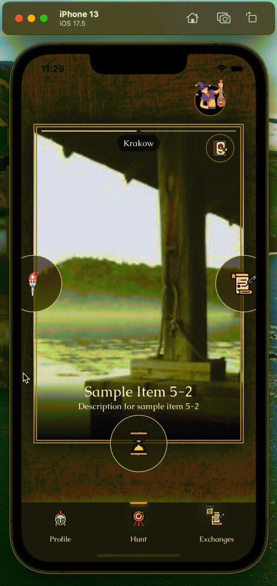
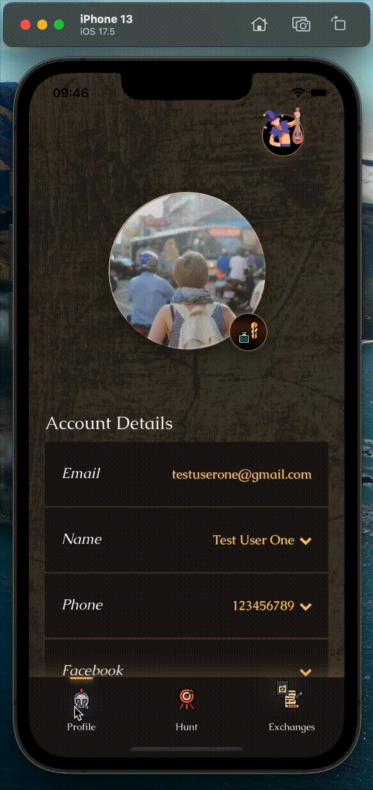
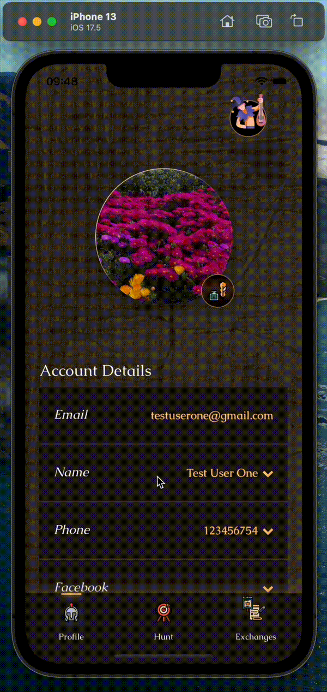
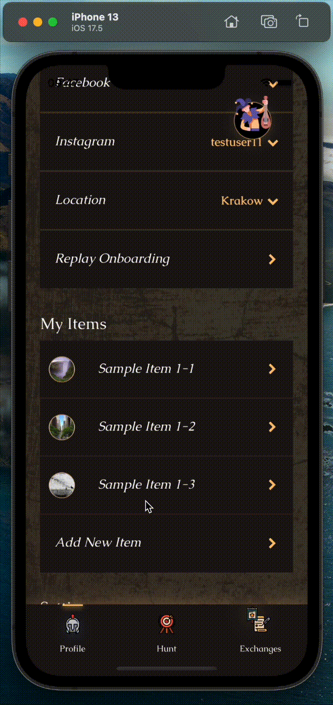
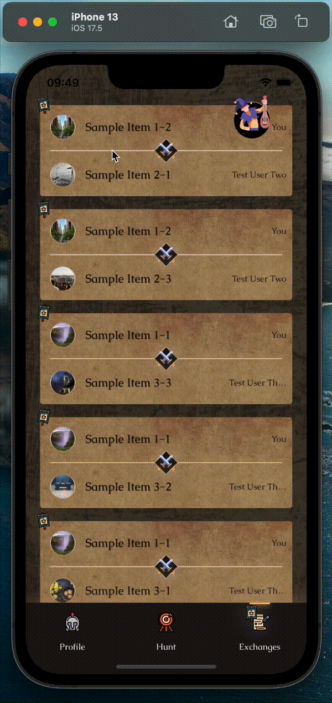
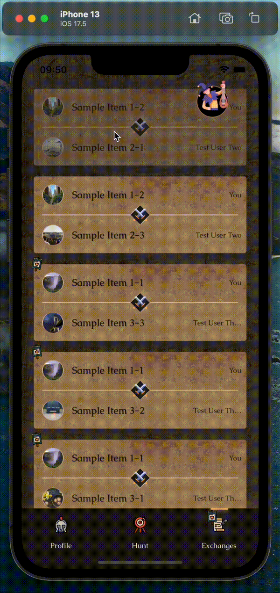

# Barter 🤝

## What it is ℹ️

A Tinder-style mobile app with a medieval feeling for cash-free exchanges. Upload your items, swipe through others', and when there’s a match — set up a trade!

## Stack 🛠️

### Mobile App 📱

- TypeScript
- React Native
- Expo
- Expo Router

### Server 🌐

- TypeScript
- Node.js
- Express
- Postgres

### Other

- socket.io for communication
- minio / backblaze for storage (AWS S3 compatible)

## Setup 🚀

⚠️ You will have to properly set up env variables before you're able to run anything

### Backend 🌐

```
cd backend
yarn run setup:reset:hardcoded:local
yarn dev
```

### Mobile 📱

```
cd mobile
yarn run env:refresh:local
npx expo start
```

## Previews 🎬

### Jester 🃏

#### Playing With Jester



### Profile Tab 👤

#### Update Info



#### Update Profile Picture


#### Add Item


#### Change Item Picture


#### Update Item



#### Remove Item



### Hunt Tab 🎯

#### Swipe & Match


### Exchanges Tab 🤝

#### Chat



#### Unmatch


